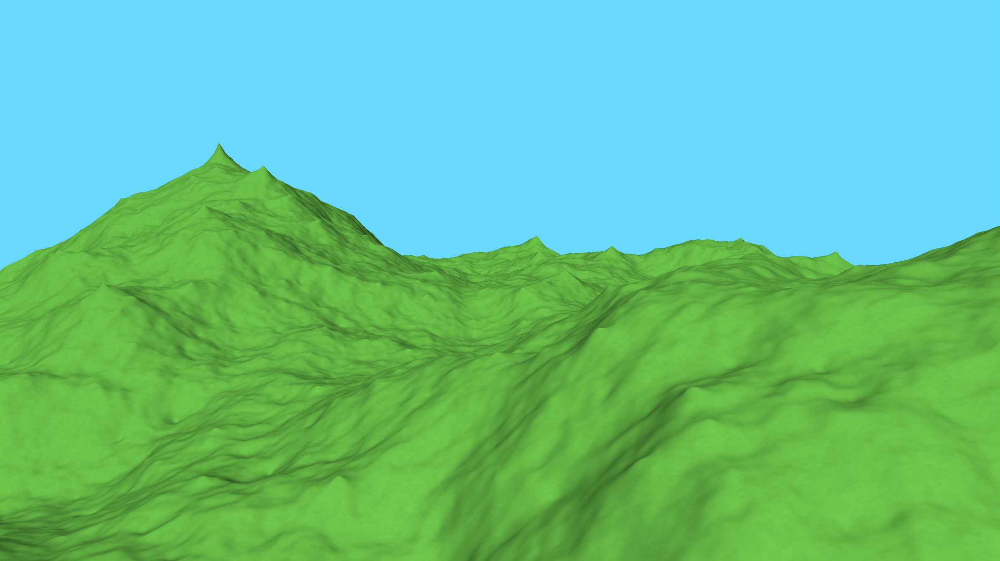

# Fractals

The aim of this program is to illustrate different types of fractals and allow you to customise various parameters to better understand how they work. They are all based on procedural modelling.

For a list of planned features, see [todo.md](new/todo.md)

## Existing Fractals

For a list of planned fractals, see [fractals.md](new/fractals.md)

* Diamond-square algorithm:

## Input Controls

Move the mouse to turn the camera and zoom with the mouse scroll.

| Key   | Action                |
|-------|-----------------------|
| ESC   | exit the program      |
| 1     | reinitialise profile  |
| SPACE | regenerate fractal    |
| W     | move camera forward   |
| S     | move camera backward  |
| A     | move camera left      |
| D     | move camera right     |
| U     | move light forward    |
| J     | move light backward   |
| I     | move light up         |
| K     | move light down       |
| O     | move light left       |
| L     | move light right      |
| F     | toggle facets         |
| N     | toggle vertex normals |
| Z     | invert fractal shine  |

## Profile Settings
These following settings allow you to adjust various parameters before running the simulation and can be found in `profile.txt`.

| Name                        | Value Range | Description                                 |
|-----------------------------|-------------|---------------------------------------------|
| _System properties_         |             |                                             |
| isFullScreenEnabled         | 0,1         | Initial toggle of fullscreen window         |
| _Environment properties_    |             |                                             |
| isPointLightingEnabled      | 0,1         | initial toggle of point/direction lighting  |
| lightPositionX              | -∞-∞        | x position of light source                  |
| lightPositionY              | -∞-∞        | y position of light source                  |
| lightPositionZ              | -∞-∞        | z position of light source                  |
| backgroundColourRed         | 0.0-1.0     | Brightness of sky red colour                |
| backgroundColourGreen       | 0.0-1.0     | Brightness of sky green colour              |
| backgroundColourBlue        | 0.0-1.0     | Brightness of sky blue colour               |
| _Fractal properties_        |             |                                             |
| isFacesEnabled              | 0,1         | Initial toggle of fractal facets            |
| areNormalsEnabled           | 0,1         | Initial toggle of vertex normals            |
| isCullingEnabled            | 0,1         | Initial toggle of vertex culling            |
| fractalDepth                | 1-∞         | Iterations in the fractal generation        |
| fractalYRange               | 0.0-∞       | Initial Y range of the fractal              |
| fractalYDeviance            | 0.0-∞       | Initial Y deviance of the fractal           |
| fractalColourRed            | 0.0-1.0     | Brightness of fractal red colour            |
| fractalColourGreen          | 0.0-1.0     | Brightness of fractal green colour          |
| fractalColourBlue           | 0.0-1.0     | Brightness of fractal blue colour           |
| isSmoothingPositionsEnabled | 0,1         | Initial toggle of vertex position smoothing |
| isSmoothingNormalsEnabled   | 0,1         | Initial toggle of vertex normal smoothing   |
| isSmoothingColoursEnabled   | 0,1         | Initial toggle of vertex colour smoothing   |
| isColourNoiseEnabled        | 0,1         | Initial toggle of vertex colour noise       |
| smoothPositionsKernelSize   | 1-∞         | Size of position smoothing kernel           |
| smoothPositionsSigmaValue   | 0.0-∞       | Sigma value of position smoothing kernel    |
| smoothNormalsKernelSize     | 1-∞         | Size of normal smoothing kernel             |
| smoothColoursKernelSize     | 1-∞         | Size of colour smoothing kernel             |
| smoothColoursSigmaValue     | 0.0-∞       | Sigma value of colour smoothing kernel      |
| colourNoiseLevel            | 0.0-1.0     | Noise level of colour noise                 |
| _Camera properties_         |             |                                             |
| cameraMovementSpeed         | 0.0-∞       | Movement speed of free mode camera          |
| cameraTurnSensitivity       | 0.0-∞       | Mouse movement/scroll sensitivity           |
| cameraFov                   | 1.0-180.0   | Field of view (in degress)                  |

## Requirements

* [GLFW 3.0](https://github.com/glfw/glfw)
* [GLEW 2.0.0 - The OpenGL Extension Wrangler Library](https://github.com/nigels-com/glew)
* [OpenGL Mathematics (GLM)](https://github.com/g-truc/glm)

If you have [Homebrew](http://brew.sh/), you can install these using `brew install glfw3 glew glm`.

## Compiling/Running

The current implementation can be found in the `new` directory, then:

* `./build.sh` to compile
* `./build.sh -r` to compile and immediately run
* `./build.sh -x` or `./main` to run

You can specify one optional argument as an existing file to use as an alternative to the default profile, e.g. `./build.sh -x profile2.txt`
